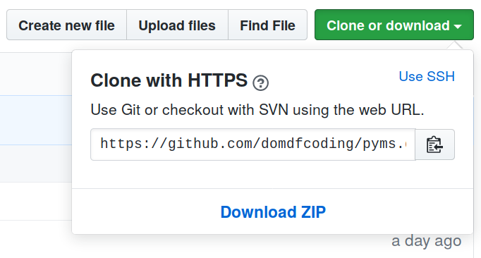

=========================
Downloading source code
=========================

The ``sphinx-toolbox`` source code is available on GitHub,
and can be accessed from the following URL: https://github.com/domdfcoding/sphinx-toolbox"

If you have ``git`` installed, you can clone the repository with the following command:

.. code-block:: bash

    $ git clone https://github.com/domdfcoding/sphinx-toolbox"
    > Cloning into 'sphinx-toolbox'...
    > remote: Enumerating objects: 47, done.
    > remote: Counting objects: 100% (47/47), done.
    > remote: Compressing objects: 100% (41/41), done.
    > remote: Total 173 (delta 16), reused 17 (delta 6), pack-reused 126
    > Receiving objects: 100% (173/173), 126.56 KiB | 678.00 KiB/s, done.
    > Resolving deltas: 100% (66/66), done.

| Alternatively, the code can be downloaded in a 'zip' file by clicking:
| :guilabel:`Clone or download` -->  :guilabel:`Download Zip`

    Downloading a 'zip' file of the source code

Building from source
-----------------------

The recommended way to build ``sphinx-toolbox`` is to use `tox <https://tox.readthedocs.io/en/latest/>`_:

.. prompt:: bash

	tox -e build

The source and wheel distributions will be in the directory ``dist``.

If you wish, you may also use `pep517.build <https://pypi.org/project/pep517/>`_ or another :pep:`517`-compatible build tool.
